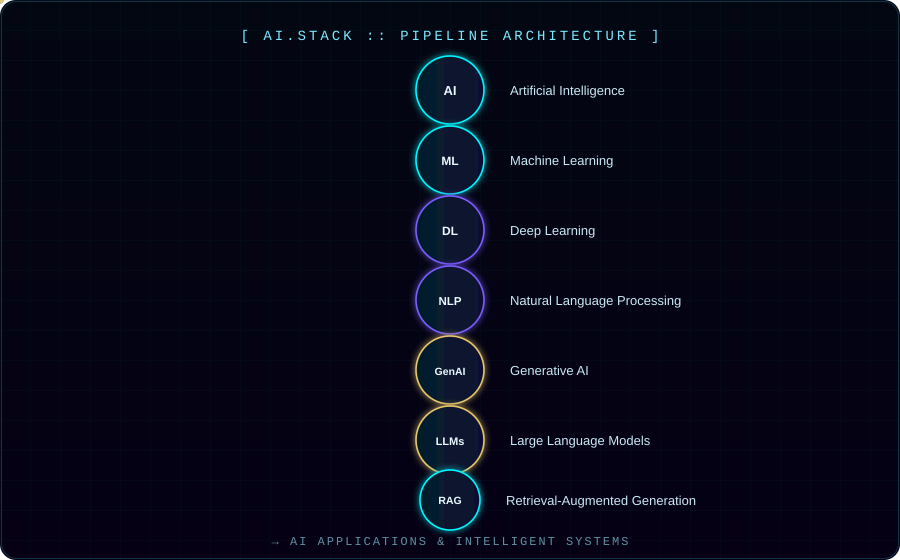

## `[ ABOUT.ME ]`

> AI &amp; ML student passionate about building intelligent systems and modern digital experiences — currently engineering my way from fundamentals to production-grade AI applications.

I'm developing skills across the full modern AI stack — **Python, Machine Learning, Deep Learning, NLP, Generative AI, LLMs, RAG** — alongside solid **Web Development** and **DSA** fundamentals. My goal is to build systems that don't just run, but *reason*.

<table>
<tr>
<td width="50%" valign="top">

### 🛰️ Currently Building
- 🤖 AI / ML projects — *coming soon*
- 🧬 LLM-powered applications
- 🔎 RAG systems
- 🎨 Generative AI experiments
- 🌐 Front-end projects

</td>
<td width="50%" valign="top">

### 📡 Currently Learning
- 🧠 Data Structures &amp; Algorithms
- 🏆 LeetCode (problem solving)
- 📊 Machine Learning &amp; Deep Learning
- 🗣️ NLP
- ⚙️ LLMs &amp; RAG pipelines
- 💻 Advanced JavaScript

</td>
</tr>
</table>

## `[ TECH.STACK ]`

**Programming Languages**

**Frontend**

**AI / ML Ecosystem**

**Libraries**

## `[ AI.STACK ]` — Specialization Architecture

`AI` → `Machine Learning` → `Deep Learning` → `NLP` → `Generative AI` → `LLMs` → `RAG` → **AI Applications**

## `[ SYSTEM.TERMINAL ]`

## `[ GITHUB.ANALYTICS ]`

## `[ CONTRIBUTIONS ]` — Contribution Snake

<picture>
  <source media="(prefers-color-scheme: dark)" srcset="https://raw.githubusercontent.com/prashanthsureshdevi/prashanthsureshdevi/output/github-contribution-grid-snake-dark.svg">
  <source media="(prefers-color-scheme: light)" srcset="https://raw.githubusercontent.com/prashanthsureshdevi/prashanthsureshdevi/output/github-contribution-grid-snake.svg">
  
</picture>

Generated automatically every day by GitHub Actions — see <code>.github/workflows/snake.yml</code>

## `[ CURRENTLY.BUILDING ]` — Projects

| Track | Status |
|---|---|
| 🤖 **AI / ML Projects** | `Coming soon` |
| 🎨 **Generative AI** | `Building` |
| 🌐 **Web Development** | `Building` |
| 🧠 **DSA / LeetCode** | `In progress` |

Placeholders — replace each row with a linked repository once a project is ready to showcase.

## `[ CONNECT ]`

⚠️ LinkedIn and LeetCode links above are placeholders — replace <code>your-linkedin-here</code> and <code>your-leetcode-here</code> with your real usernames.

⚡ Built with SVG, GitHub Actions &amp; a lot of curiosity — <code>prashanthsureshdevi/prashanthsureshdevi</code>

